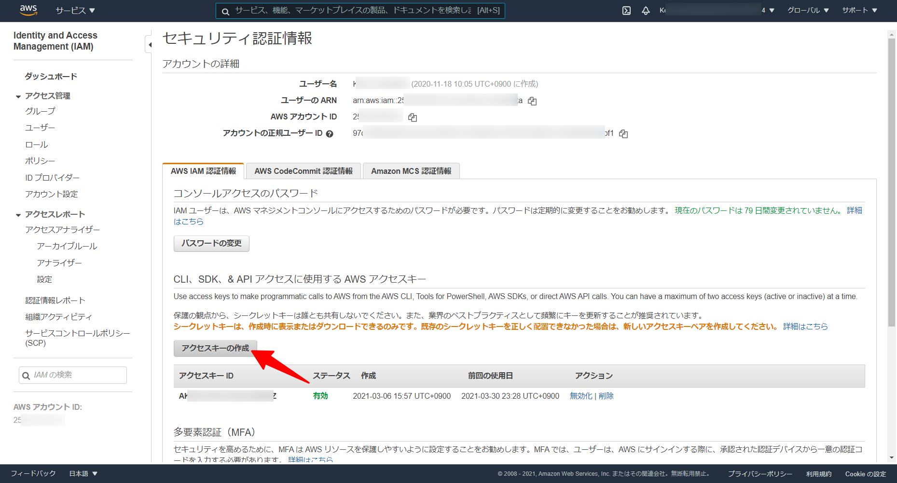
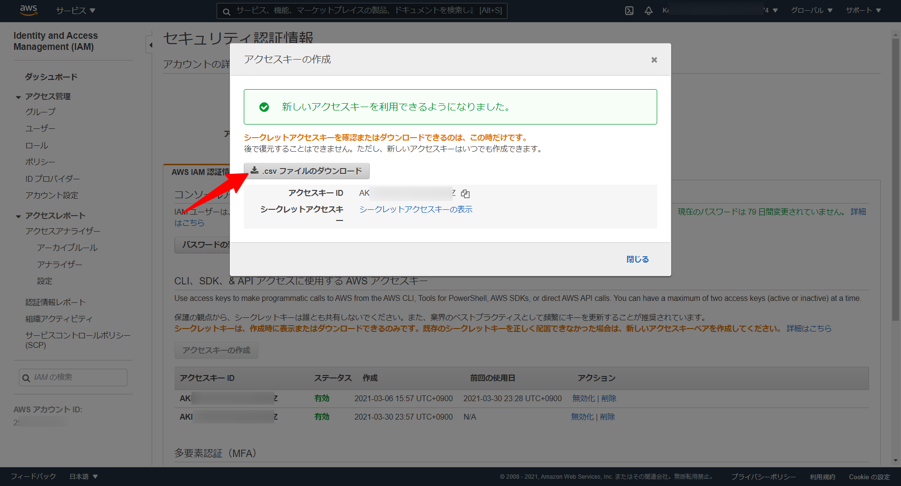
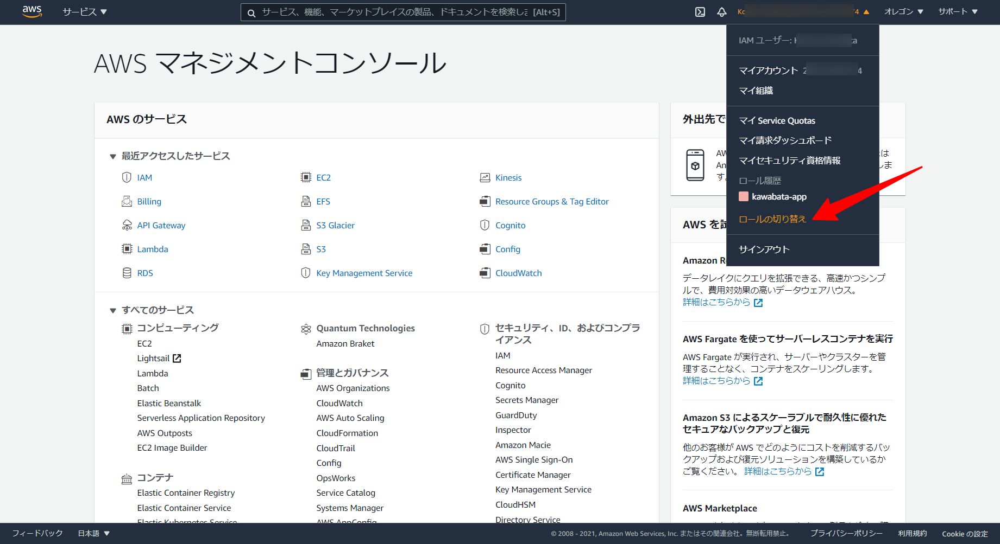
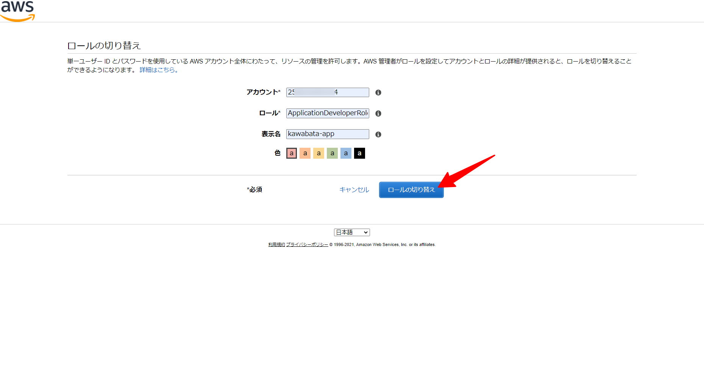
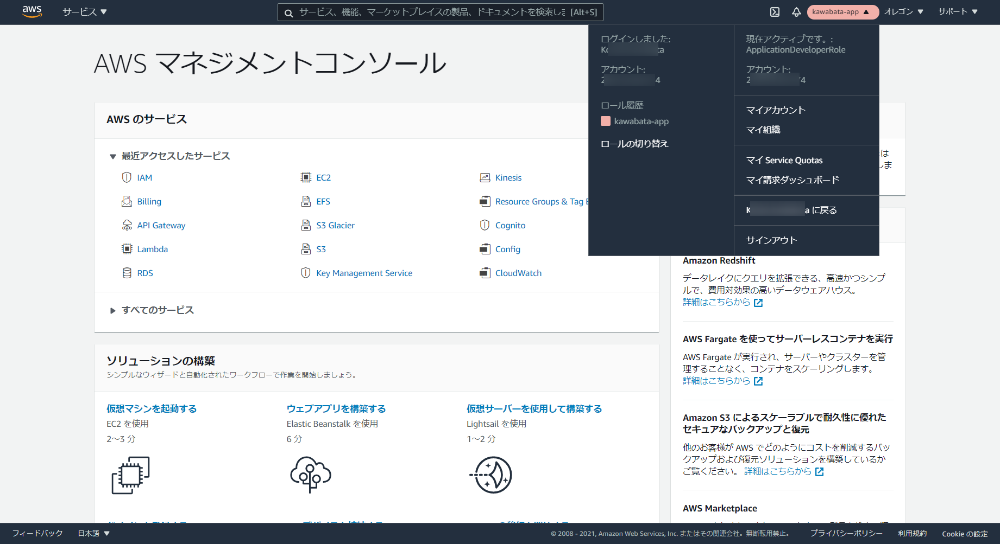
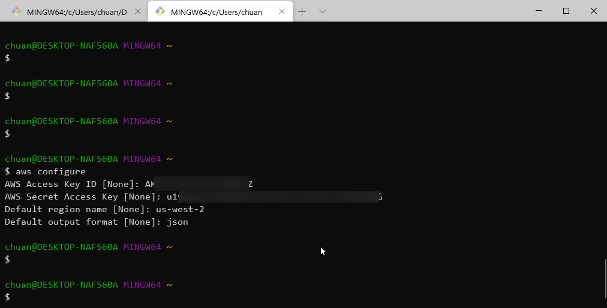
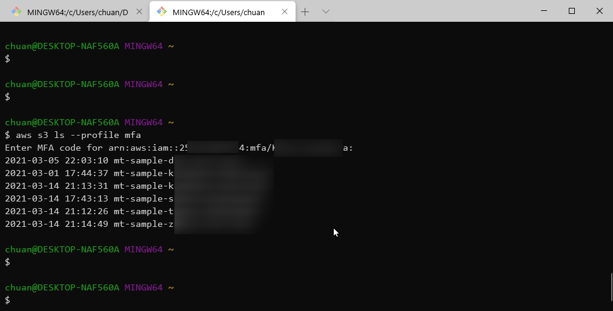

# AWS CLI設定マニュアル

## コンソール上で設定するもの

### ①多要素認証（MFA）

#### 1. AWS マネジメントコンソール上部の`ユーザ名@アカウントID`をクリックし、プルダウンから「マイセキュリティ資格情報」を選択

<details><summary>画像を見る</summary><div>

</div></details>

#### 2. [AWS公式ドキュメント](https://docs.aws.amazon.com/ja_jp/IAM/latest/UserGuide/id_credentials_mfa_enable_virtual.html?icmpid=docs_iam_console#enable-virt-mfa-for-own-iam-user)などを参考にしてMFAを有効化

下図はすでに有効化が完了しているものです。

<details><summary>画像を見る</summary><div>

</div></details>

#### 3. 有効化が完了したら一度サインアウトし、再度サインイン

その際MFA認証が要求されればOKです。

### ②アクセスキー

#### 1. AWS マネジメントコンソール上部の`ユーザ名@アカウントID`をクリックし、プルダウンから「マイセキュリティ資格情報」を選択

MFA有効化と同じ画面です。

<details><summary>画像を見る</summary><div>

</div></details>

#### 2. 「アクセスキーの作成」をクリック

<details><summary>画像を見る</summary><div>

</div></details>

#### 3. ウィンドウが出てくるので、「csvファイルのダウンロード」をクリック

作成したアクセスキーをダウンロードできるのはこの１回限りなので注意してください。

<details><summary>画像を見る</summary><div>

</div></details>

#### 4. ダウンロードしたcsvファイルを無くさないように、そして流出しない(!!!)ように、ローカルPC内で大切に保管

> アクセスキーは流出しないように、特に間違えてもGitHubに上げないようにくれぐれも取り扱いには気をつけてください！\
> 流出したらどんなことが起きるのかは下のサイトなどが詳しいです。
> - [GitHub に AWS キーペアを上げると抜かれるってほんと？？？試してみよー！](https://qiita.com/saitotak/items/813ac6c2057ac64d5fef)

### ③スイッチロール

開発チームのIAMユーザーにアタッチされているIAMポリシーは`PowerUserAccess`です。なのでIAMまわりの参照・変更は総じてできないようになっています。\
ですがLambdaの実行ロールを作成・編集するためにはIAMロールやIAMポリシーを参照・変更する必要が出てきます。\
そこで`ApplicationDeveloperRole`というIAMロールを用意しています。そこには`PowerUserAccess`以外にLambdaの実行ロールを作成・編集するためのポリシーがアタッチされています。\
開発チームのIAMユーザーはこのIAMロールにスイッチすることでLambdaまわりの設定を行えるようになります。

#### 1. AWS マネジメントコンソール上部の`ユーザ名@アカウントID`をクリックし、プルダウンから「ロールの切り替え」を選択

<details><summary>画像を見る</summary><div>

</div></details>

#### 2. 以下の項目を入力して「ロールの切り替え」をクリック

- アカウント: `25*********4`（「マイアカウント」の横に表示されている12桁のアカウントID）
- ロール: `ApplicationDeveloperRole`
- 表示名: `{名前}-app`（任意ですがこうしておくと分かりやすいと思います）
- 色: 自由に好きな色を選んでください

<details><summary>画像を見る</summary><div>

</div></details>

#### 3. 切り替え後の画面

下図のようになったらOKです。

<details><summary>画像を見る</summary><div>

</div></details>


## ローカルPC上で設定するもの

### ①`aws configure`

Git Bash/ターミナルを開いて、`aws configure`を実行します。プロンプトにしたがって以下の各項目を入力します。

- AWS Access Key ID: ②4でダウンロードしたcsvの`Access key ID`
- AWS Secret Access Key: ②4でダウンロードしたcsvの`Secret access key`
- Default region name: `us-west-2`
- Default output format: `json`



### ②`code ~/.aws`

Git Bash/ターミナルで`code ~/.aws`を実行すると、VSCodeの画面が開きます。（もし開かない場合は[こちらの記事](https://qiita.com/naru0504/items/c2ed8869ffbf7682cf5c)を参考にして、実行できるように設定してください）

VSCodeが開くと`credentials`と`config`の２ファイルが置かれています。`config`を以下のように書き換え、保存します。

```sh
[default]
region = us-west-2
output = json

[profile mfa]
source_profile = default
mfa_serial = arn:aws:iam::25*********4:mfa/{名}_{姓}
role_arn = arn:aws:iam::25*********4:role/ApplicationDeveloperRole

# 25********4は実際のアカウントIDに、
# {名}_{姓}は実際のIAMユーザー名に置き換えてください
```

### ③実行確認

Git Bash/ターミナルで`aws s3 ls --profile mfa`を実行すると、MFAコードの入力を要求されます。入力してEnterを押し、S3バケット名が表示されれば確認は終了です。

<details><summary>画像を見る</summary><div>

</div></details>
