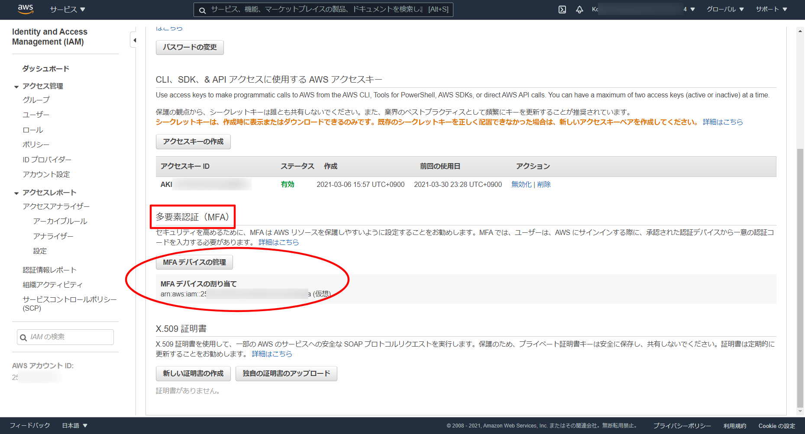

# AWS CLI設定手順

## コンソール上で設定するもの

### 多要素認証（MFA）

1. AWS マネジメントコンソール上部の`ユーザ名@アカウントID`をクリックし、プルダウンから「マイセキュリティ資格情報」を選択

2. [AWS公式サイト](https://docs.aws.amazon.com/ja_jp/IAM/latest/UserGuide/id_credentials_mfa_enable_virtual.html?icmpid=docs_iam_console#enable-virt-mfa-for-own-iam-user)などを参考にしてMFAを有効化（下図はすでに有効化が完了しているもの）

