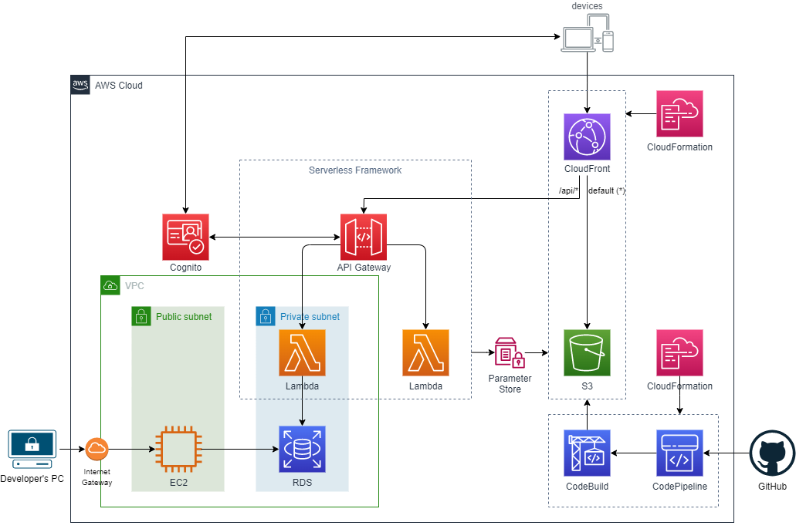

# アーキテクチャ

## 全体アーキテクチャ

## 初回デプロイ手順

1. Serverless Frameworkを使用し、API GatewayおよびLambda関数をデプロイする。それと同時に、作成されたAPI GatewayのエンドポイントをParameter Storeに書き込む。
1. CloudFormation(テンプレート: `cloudfront.yml`)を使用し、ReactアプリをホストするS3バケットとCloudFrontディストリビューションを構築する。CloudFrontのオリジンはS3とAPI Gatewayの2つを設定する。
1. CloudFormation(テンプレート: `codepipeline.yml`)を使用し、ReactアプリをデプロイするCodePipelineを構築する。

## プログラム更新時のデプロイ手順

### APIの更新

1. Serverless Frameworkを使用し、API GatewayおよびLambdaの差分をデプロイする。

### Reactアプリの更新

1. CodePipelineがGitHubソースコードの変更を追跡していて、新規にコミットが追加されるとパイプラインが実行され、Reactアプリがデプロイされる。
