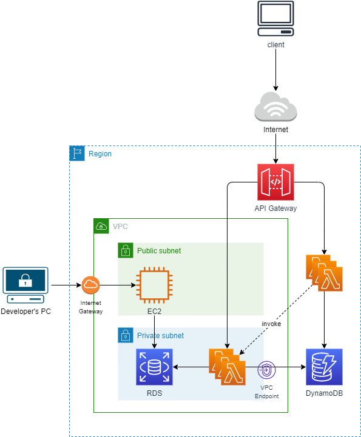

# Serverless FrameworkでLambda関数をデプロイ

## 前提
開発ドキュメントにある[環境構築手順書](../docs/01_development/01_environment_setup.md)および[AWS CLI設定マニュアル](../docs/01_development/02_awscli_setup.md)の設定が完了していることが前提条件となります。\
以下に挙げるコマンドはGit Bash（Windows環境）またはターミナル（macOS環境）で実行してください。

## Lambda関数デプロイ手順
Lambda関数をAWS環境上にデプロイする手順について記載します。Serverless Frameworkを使用することで、Lambda関数のほかLambdaレイヤーやLambda関数に付与するIAMロール（実行ロール）、API Gatewayをデプロイする際の設定を一元で管理することができます。（`serverless.yml`）

### 1. npmでServerless Frameworkをインストール

```bash
npm install -g serverless
serverless --version
```

### 2. Lambda関数、レイヤーをzip化

Dockerデーモンを起動した状態にし、以下のコマンドを実行してください。

```bash
# カレントディレクトリはこのREADME.mdと同じ階層で
# ターミナル（macOS）では
sh bin/setup.sh
# Git Bash（Windows）では
bash bin/setup.win.sh
```

### 3. Servereless FrameworkがAWSのプロファイル情報を読み込めるようにする

以下のコマンドで、`~/.aws/credentials`と`~/.aws/config`からmfaプロファイルを読み込めるようになります。

```bash
source bin/export_aws_profile.sh
```

### 4. デプロイを実行

`serverless deploy`コマンドでデプロイを実行します。\
その際`ステージ名`を指定する必要があります。ステージ名は`kawabata`のように名字（小文字）にしてください。

```bash
serverless deploy --stage {ステージ名}
```

## アーキテクチャ



- クライアントはAPI Gatewayのエンドポイントに対してリクエストすると、API GatewayがLambda関数を呼び出し、Lambda関数からのレスポンスをAPI Gatewayが変換してクライアントにレスポンスが返される
- インターネットアクセス可能なLambda（VPCの外にいる）とRDSにアクセス可能なVPC Lambda（private subnetに接続する）の２種類がある
- VPC LambdaからはVPCエンドポイント経由でDynamoDBにアクセスする
- 開発者がRDSの中身を見るにはpublic subnetに配置されている踏み台EC2インスタンス経由でアクセスする
