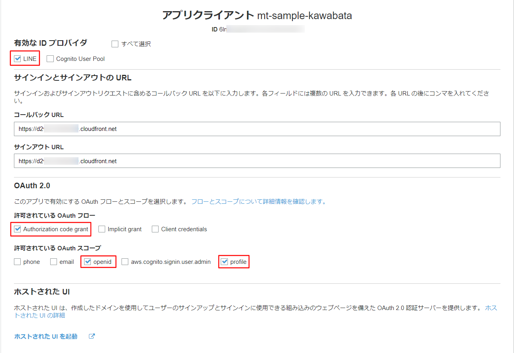

# LINEログインを用いた認証機能

## 認証〜ユーザ情報取得の流れ

1. ブラウザから`xxxxxx.cloudfront.net`にアクセス

2. オリジンのS3にルーティング

3. サービス画面から`Log in with LINE`ボタンをクリック

4. Cognitoが提供するHosted UIページに遷移

5. Hosted UIページの`LINE`ボタンをクリック（サードパーティー経由のサインイン：フェデレーション）

6. LINEの認証エンドポイントにリクエスト

7. ユーザとLINEプラットフォーム間でユーザ認証

8. 認証プロセス完了後、CognitoのコールバックURLにリダイレクト

9. Cognitoがよしなに連携して認可コードを発行

10. Amplify（のCognito SDK）がよしなに連携してIDトークン（JWT）を取得

11. IDトークンをAuthorizationヘッダーに埋め込んで、`xxxxxx.cloudfront.net/api/userinfo`にリクエスト

12. オリジンのAPI Gatewayにルーティング

13. API Gatewayの`/userinfo`エンドポイントに設定されたCognitoオーソライザーがトークンを検証

14. Lambda関数が入力（の`requestContext`）からユーザ情報を取得し返却

## アーキテクチャ

## Cognitoユーザープール設定
特に説明の無い項目はデフォルトのまま

### 全般設定

#### 属性
必須な標準属性は`name`と`picture`を選択する。  
※一度設定してしまうと後から変更不可なので要注意

#### アプリクライアント
「クライアントシークレットを生成」のチェックを外す。  
※クライアントシークレットを設定してしまうと、Amplifyで認証できなくなる（["App client secret needs to be disabled"](https://docs.amplify.aws/lib/client-configuration/configuring-amplify-categories/q/platform/js/#authentication-amazon-cognito)）

### フェデレーション

#### IDプロバイダー

- `クライアントID`: LINE Channelsの`Channel ID`
- `クライアントのシークレット`: LINE Channelsの`Channel secret`

#### 属性マッピング

### アプリの統合

#### ドメイン名
適切にドメイン名（プレフィックス）を設定する。

#### アプリクライアントの設定
有効なIDプロバイダは`LINE`のみを選択する。  
（`Cognito User Pool`を選択するとメールアドレス認証も有効になる）

- `許可されているOAuthフロー`: `Authorization code grand`
- `許可されているOAuthスコープ`: `openid`, `profile`

